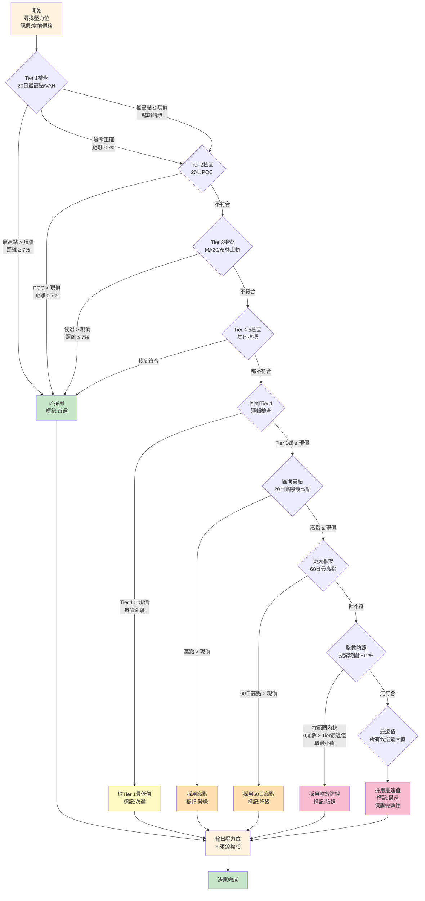

# 中期（20日）支撐壓力決策流程圖

## 核心參數
- **時間框架：** 20日
- **最小距離：** 7%
- **目標：** 為當前股價識別1-2週內的支撐和壓力位

---

## 支撐位決策流程


---

## 壓力位決策流程



---

## 中期決策表

| 階段 | 操作 | 支撐候選 | 壓力候選 | 成功條件 |
|------|------|---------|---------|---------|
| **1** | Tier 1-5搜尋 | 20日最低點、VAL、POC、MA20、布林下軌 | 20日最高點、VAH、POC、MA20、布林上軌 | 邏輯正確 + 距離≥7% |
| **2** | Tier 1邏輯檢查 | 20日最低點/VAL 中的最高值 | 20日最高點/VAH 中的最低值 | 邏輯正確，距離可忽略 |
| **3** | 框架極值 | 20日實際最低點 | 20日實際最高點 | 候選 < 現價（支撐）或 > 現價（壓力） |
| **4** | 更大框架 | 60日最低點 | 60日最高點 | 候選 < 現價（支撐）或 > 現價（壓力） |
| **5** | 級聯框架 | N/A（中期無級聯） | N/A（中期無級聯） | - |
| **6** | 整數防線 | 0尾數，範圍±12% | 0尾數，範圍±12% | 範圍內有符合的整數 |
| **7** | 最遠值 | 所有候選最小值 | 所有候選最大值 | 保證必有輸出 |

---

## 與短期的差異

| 項目 | 短期（5日） | 中期（20日） |
|------|----------|----------|
| **周期** | 5日 | 20日 |
| **最小距離** | 3% | 7% |
| **Tier 1** | 5日最低/最高點 | 20日最低/最高點 |
| **降級目標** | 20日高低點 | 60日高低點 |
| **整數防線類型** | 0/5尾數 | 0尾數 |
| **防線搜索範圍** | ±5% | ±12% |

---

## 中期整數防線搜索規則

### 支撐（0尾數）
```
搜索範圍：Tier最遠值 × (1 - 12%) ~ Tier最遠值
目標：找 < Tier最遠值 的最大0尾數
例：Tier最遠值 = 1850
    範圍 = 1628 ~ 1850
    候選 = 1800、1700、...
    選用 = 1800（最大的0尾數）
```

### 壓力（0尾數）
```
搜索範圍：Tier最遠值 ~ Tier最遠值 × (1 + 12%)
目標：找 > Tier最遠值 的最小0尾數
例：Tier最遠值 = 1950
    範圍 = 1950 ~ 2184
    候選 = 2000、2100、2150...
    選用 = 2000（最小的0尾數）
```

---

## 執行要點

1. **距離檢查公式：** `距離(%) = |候選值 - 現價| / 現價 × 100%`

2. **中期的7%最小距離意義：**
   - 排除短期波動的干擾
   - 確保支撐壓力具有1-2週以上的持續性
   - 適合周線交易和中期趨勢跟蹤

3. **更寬鬆的整數防線：**
   - 短期：±5%（更嚴格，短期不會波動太大）
   - 中期：±12%（更寬鬆，中期波動較大）
   - 允許在更大幅度內尋找心理防線

4. **降級順序的邏輯：**
   - 優先使用20日指標（當前框架）
   - 次級使用60日指標（更大框架，趨勢參考）
   - 最後使用整數防線（心理防線）
   - 絕對保障：最遠值

5. **三框架協同使用建議：**
   - 短期支撐與中期支撐一致 → 強支撐
   - 短期壓力與中期壓力一致 → 強壓力
   - 三個框架都指向同方向 → 市場信號最強

