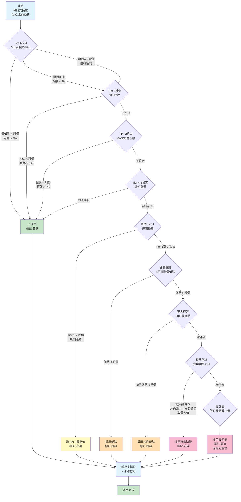

# 短期（5日）支撐壓力決策流程圖

## 核心參數
- **時間框架：** 5日
- **最小距離：** 3%
- **目標：** 為當前股價識別短期支撐和壓力位

---

## 支撐位決策流程

---

## 壓力位決策流程

---

## 短期決策表

| 階段 | 操作 | 支撐候選 | 壓力候選 | 成功條件 |
|------|------|---------|---------|---------|
| **1** | Tier 1-5搜尋 | 5日最低點、VAL、POC、MA5、布林下軌 | 5日最高點、VAH、POC、MA5、布林上軌 | 邏輯正確 + 距離≥3% |
| **2** | Tier 1邏輯檢查 | 5日最低點/VAL 中的最高值 | 5日最高點/VAH 中的最低值 | 邏輯正確，距離可忽略 |
| **3** | 框架極值 | 5日實際最低點 | 5日實際最高點 | 候選 < 現價（支撐）或 > 現價（壓力） |
| **4** | 更大框架 | 20日最低點 | 20日最高點 | 候選 < 現價（支撐）或 > 現價（壓力） |
| **5** | 級聯框架 | N/A（短期無級聯） | N/A（短期無級聯） | - |
| **6** | 整數防線 | 0/5尾數，範圍±5% | 0/5尾數，範圍±5% | 範圍內有符合的整數 |
| **7** | 最遠值 | 所有候選最小值 | 所有候選最大值 | 保證必有輸出 |

---

## 顏色標識說明

| 顏色 | 含義 | 優先級 |
|------|------|--------|
| 🟢 綠色 | 首選（Tier 1-5 + 距離符合） | 最高 |
| 🟡 黃色 | 次選（Tier 1邏輯正確，距離不足） | 高 |
| 🟠 橙色 | 降級（框架高低點） | 中 |
| 🔴 紅色 | 防線（整數位置） | 中下 |
| 🔴 紅色 | 最遠值（最後保障） | 最低 |

---

## 執行要點

1. **距離檢查公式：** `距離(%) = |候選值 - 現價| / 現價 × 100%`

2. **必須符合邏輯：**
   - 支撐 < 現價
   - 壓力 > 現價

3. **短期的整數防線尋找規則：**
   - 支撐：在 [Tier最遠值 × (1-5%) ~ Tier最遠值] 內，找 < Tier最遠值 的最大0/5尾數
   - 壓力：在 [Tier最遠值 ~ Tier最遠值 × (1+5%)] 內，找 > Tier最遠值 的最小0/5尾數

4. **保障機制：**
   - 即使所有技術指標失敗，第6階段整數防線兜底
   - 若整數防線也失敗，第7階段最遠值絕對保證有輸出

