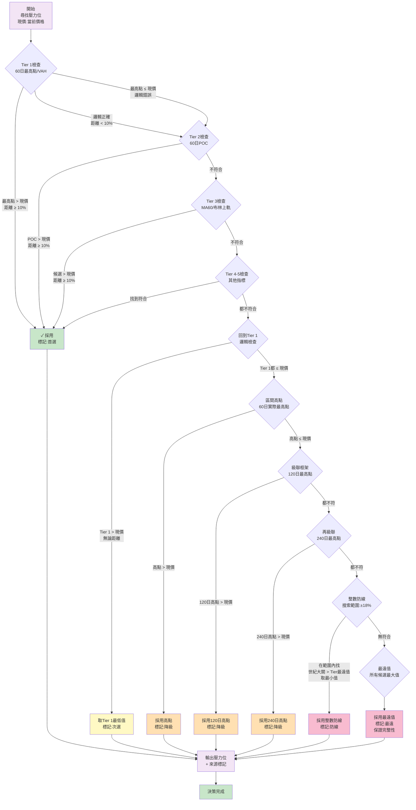

# 長期（60日）支撐壓力決策流程圖

## 核心參數
- **時間框架：** 60日
- **最小距離：** 10%
- **目標：** 為當前股價識別數週至數月內的支撐和壓力位

---

## 支撐位決策流程


---

## 壓力位決策流程



---

## 長期決策表

| 階段 | 操作 | 支撐候選 | 壓力候選 | 成功條件 |
|------|------|---------|---------|---------|
| **1** | Tier 1-5搜尋 | 60日最低點、VAL、POC、MA60、布林下軌 | 60日最高點、VAH、POC、MA60、布林上軌 | 邏輯正確 + 距離≥10% |
| **2** | Tier 1邏輯檢查 | 60日最低點/VAL 中的最高值 | 60日最高點/VAH 中的最低值 | 邏輯正確，距離可忽略 |
| **3** | 框架極值 | 60日實際最低點 | 60日實際最高點 | 候選 < 現價（支撐）或 > 現價（壓力） |
| **4** | 級聯框架I | 120日最低點 | 120日最高點 | 候選 < 現價（支撐）或 > 現價（壓力） |
| **5** | 級聯框架II | 240日最低點 | 240日最高點 | 候選 < 現價（支撐）或 > 現價（壓力） |
| **6** | 整數防線 | 世紀大關，範圍±18% | 世紀大關，範圍±18% | 範圍內有符合的世紀大關 |
| **7** | 最遠值 | 所有候選最小值 | 所有候選最大值 | 保證必有輸出 |

---

## 三框架比較表

| 項目 | 短期（5日） | 中期（20日） | 長期（60日） |
|------|----------|----------|----------|
| **周期** | 5日 | 20日 | 60日 |
| **最小距離** | 3% | 7% | 10% |
| **使用對象** | 短線交易者 | 周線交易者 | 長期持有者 |
| **Tier 1** | 5日極值 | 20日極值 | 60日極值 |
| **第3階段** | 5日高低點 | 20日高低點 | 60日高低點 |
| **第4階段** | 20日高低點 | 60日高低點 | 120日高低點 |
| **第5階段** | 無 | 無 | 240日高低點 |
| **整數防線類型** | 0/5尾數 | 0尾數 | 世紀大關 |
| **防線搜索範圍** | ±5% | ±12% | ±18% |

---

## 長期整數防線搜索規則

### 世紀大關定義
```
1000元級：1000、2000、3000...
500元級：500、1500、2500...
200元級：200、400、600、800...
100元級：100、200、300...
50元級：50、100、150...（階級轉換點）
```

### 支撐（世紀大關）
```
搜索範圍：Tier最遠值 × (1 - 18%) ~ Tier最遠值
目標：找 < Tier最遠值 的最大世紀大關
例：Tier最遠值 = 1743
    範圍 = 1429 ~ 1743
    世紀大關候選 = 1500、1000...
    選用 = 1500（最大的世紀大關）
```

### 壓力（世紀大關）
```
搜索範圍：Tier最遠值 ~ Tier最遠值 × (1 + 18%)
目標：找 > Tier最遠值 的最小世紀大關
例：Tier最遠值 = 2100
    範圍 = 2100 ~ 2478
    世紀大關候選 = 2200、2500...
    選用 = 2200（最小的世紀大關）
```

---

## 長期框架的特殊特性

### 1. 級聯機制（Tier 4-5）
- 短期和中期：只有一個更大框架（短期→20日，中期→60日）
- **長期獨有：** 可級聯到120日、240日，確保長期支撐壓力的穩定性

### 2. 寬鬆的距離要求
- 短期：3%（嚴格，反映日內波動）
- 中期：7%（中等，反映周線波動）
- **長期：10%（寬鬆，反映月線波動）**

### 3. 心理防線的重要性
- 短期：整數尾數（如105、110、115）
- 中期：整數位（如100、110、120）
- **長期：世紀大關（如1000、2000、500），機構級別的心理防線**

---

## 執行要點

1. **距離檢查公式：** `距離(%) = |候選值 - 現價| / 現價 × 100%`

2. **長期的10%最小距離意義：**
   - 代表完整的月線級別走勢
   - 排除短期和中期的波動干擾
   - 適合長期投資者制定買賣策略

3. **級聯邏輯的意義：**
   - 60日失效 → 嘗試120日（2個月）
   - 120日失效 → 嘗試240日（半年以上）
   - 保證找到長期趨勢的支撐壓力

4. **世紀大關的實戰意義：**
   - 整數位置是交易者的心理點位
   - 機構往往在此設置訂單
   - 統計上這些位置的成交量明顯更高
   - 長期重點防守這些位置

5. **三框架的協同應用：**
   ```
   最強信號：三個框架的支撐/壓力高度一致
   強信號：任意兩個框架一致
   中等信號：只有一個框架有清晰信號
   弱信號：各框架指向不同方向
   ```

6. **價格區間與世紀大關的對應：**
   | 價格區間 | 主要世紀大關 |
   |---------|-----------|
   | < 100元 | 10、50、100 |
   | 100-500元 | 100、200、300、500 |
   | 500-1000元 | 500、1000 |
   | 1000-2000元 | 1000、1500、2000 |
   | 2000元以上 | 1000、2000、2500、3000倍數 |

---

## 決策完整性保證

```
若Tier 1-5都失敗
  → 階段3：60日高低點
  
若階段3失敗
  → 階段4：120日高低點
  
若階段4失敗
  → 階段5：240日高低點
  
若階段5失敗
  → 階段6：世紀大關（±18%內尋找）
  
若階段6失敗
  → 階段7：所有候選的最遠值
  
【保證】無論市場如何極端波動，必然有輸出
```

